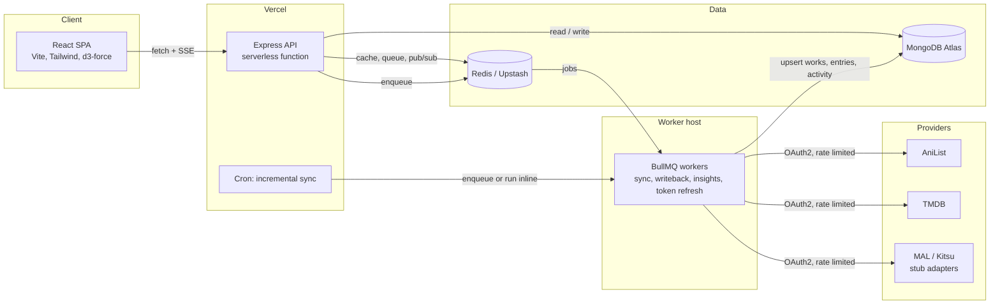
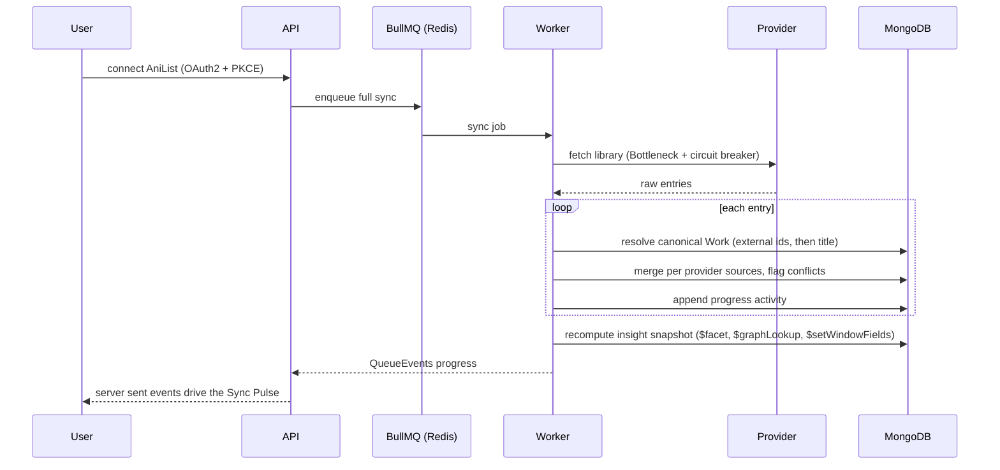

<div align="center">


# Kanzen

**Every media tracker you use, in one place. Anime, manga, books, and movies.**

Connect AniList, MyAnimeList, Kitsu, and TMDB. Kanzen folds every list into one canonical
library, reconciles the differences, and turns the whole thing into a living chart of your taste.

[](https://github.com/Abudora-0/Kanzen/actions/workflows/ci.yml)
[](./LICENSE)
[](.nvmrc)
[](tsconfig.base.json)
[](./CONTRIBUTING.md)
[](https://vercel.com/new)

`react` · `express` · `mongodb-aggregation` · `bullmq` · `redis` · `oauth2` · `data-visualization`

</div>

---

## Why Kanzen

Most trackers are a single list on a single platform. If you rate an anime on AniList, watch a
film logged on TMDB, and read a manga tracked on MyAnimeList, your history is scattered and your
statistics are partial. Kanzen is the layer above:

- **One library.** Every connected platform is pulled into a canonical `Work` catalogue with
  cross referenced ids, so the same title from three services is one entry.
- **Honest reconciliation.** When platforms disagree on your progress, status, or score, Kanzen
  surfaces the conflict and lets you resolve it in one click, then pushes the result back.
- **Insight from real aggregation.** Taste fingerprint, completion velocity with a trailing mean,
  franchise depth by graph traversal, a watch and read heatmap, and predicted finish dates, all
  computed with MongoDB aggregation pipelines.
- **A sync engine you can watch.** Background queues, per provider rate limiting, and a circuit
  breaker, visualised on a live radar as they run.

## Screens

| The deck                                        | Insights                | Constellation                             |
| ----------------------------------------------- | ----------------------- | ----------------------------------------- |
| Counters, the continue list, and the sync pulse | Seven aggregation views | A force directed star map of your library |

> The interface is "Shelf": warm and editorial, cream in light and warm charcoal in dark, with a
> rust accent and sage as a secondary. It follows your system theme and has a manual toggle. The
> logo is a stack of cards that fans open on load, and a rust bar runs along its base while a sync
> runs. Scrollbars, counters, dropdowns, toggles, and sliders are all themed, and everything
> respects `prefers-reduced-motion`.

## Architecture



### The sync pipeline



### Monorepo layout

```
apps/
  web/       Vite + React + Tailwind v4 + Framer Motion + d3-force
  api/       Express + Mongoose + BullMQ producer + zod  (also exports ./worker)
  worker/    thin entrypoint that runs the BullMQ consumers
packages/
  shared/    domain types, zod schemas, status mapping tables
  providers/ MediaProvider adapter interface + AniList, TMDB, MAL, Kitsu + fixtures
api/index.ts       Vercel serverless entry that wraps the Express app
```

## Aggregation highlights

Every insight is a named pipeline builder in `apps/api/src/insights/pipelines.ts`, unit tested
against `mongodb-memory-server`.

| Insight              | Technique                                                                                                 |
| -------------------- | --------------------------------------------------------------------------------------------------------- |
| Taste fingerprint    | `$lookup` + `$unwind` over combined genre and tag axis, score and progress weighted `$group`              |
| Completion velocity  | `$dateTrunc` monthly `$group`, three month trailing mean via `$setWindowFields`                           |
| Library profile      | one `$facet` returning status, format, `$bucket` score histogram, studios, and decade cuts                |
| Cross platform drift | conflict flagged entries projected into a human readable disagreement                                     |
| Activity heatmap     | `ActivityLog` grouped by `$dateToString` day over 53 weeks                                                |
| Franchise depth      | `$graphLookup` walking `Work.relations` to assemble a franchise, ownership resolved against the entry set |
| Predicted finishes   | remaining units divided by a trailing per day pace from the activity log                                  |

## Running it locally

Requirements: Node 20.11 or newer, pnpm 11, and either Docker or a local MongoDB and Redis.

```bash
git clone https://github.com/Abudora-0/Kanzen.git
cd Kanzen
pnpm install
cp .env.example .env

# start datastores (or point .env at your own)
docker compose up -d

# seed the demo library (about 45 works across four media types)
pnpm seed

# web on :5173, api on :4000, worker attached
pnpm dev
```

Open `http://localhost:5173` and choose **Explore the demo**, or sign in with
`demo@kanzen.app` / `constellation`.

No Docker? The API ships a helper that runs an ephemeral MongoDB:

```bash
node apps/api/scripts/local-mongo.mjs   # keep this running
pnpm seed && pnpm dev                    # Redis is optional, the app degrades gracefully
```

### Scripts

| Command                        | Does                                                       |
| ------------------------------ | ---------------------------------------------------------- |
| `pnpm dev`                     | web, api, and worker together with hot reload              |
| `pnpm build`                   | build every package and app                                |
| `pnpm test`                    | Vitest across packages, including DB backed pipeline tests |
| `pnpm test:e2e`                | Playwright smoke run against a seeded demo                 |
| `pnpm seed`                    | reset and populate the demo library                        |
| `pnpm lint` / `pnpm typecheck` | ESLint and project wide `tsc --noEmit`                     |
| `pnpm check:prose`             | fail on em or en dashes anywhere in tracked text           |

## Environment

| Variable                                     | Purpose                                                                                 |
| -------------------------------------------- | --------------------------------------------------------------------------------------- |
| `MONGODB_URI`                                | MongoDB connection string                                                               |
| `REDIS_URL`                                  | Redis connection string, `rediss://` enables TLS for Upstash                            |
| `JWT_ACCESS_SECRET`, `JWT_REFRESH_SECRET`    | session token signing keys                                                              |
| `TOKEN_ENCRYPTION_KEY`                       | 32 byte hex key, encrypts provider tokens at rest with AES-256-GCM                      |
| `PROVIDERS_DEMO_MODE`                        | `true` serves fixture data and needs no OAuth, this is the showcase default             |
| `DEMO_EMAIL`, `DEMO_PASSWORD`                | the seeded read only demo account                                                       |
| `ANILIST_CLIENT_ID`, `ANILIST_CLIENT_SECRET` | AniList OAuth, redirect `<API_PUBLIC_URL>/api/connections/anilist/callback`              |
| `MAL_CLIENT_ID`, `MAL_CLIENT_SECRET`         | MyAnimeList OAuth, redirect `<API_PUBLIC_URL>/api/connections/mal/callback`              |
| `TMDB_READ_TOKEN`                            | TMDB v4 read access token, also enriches seed cover art                                 |
| `WEB_ORIGIN`, `API_PUBLIC_URL`               | deployment origin, required for OAuth redirects when demo mode is off                   |
| `CRON_SECRET`                                | bearer token the Vercel cron sends to `/api/cron/sync`                                  |
| `VITE_API_URL`                               | only when the web app and API are on different origins                                  |

Full list with notes is in [`.env.example`](.env.example).

## Deploying to Vercel

[`vercel.json`](vercel.json) builds `apps/web`, serves the SPA, and routes `/api/*` to the Express
app in [`api/index.ts`](api/index.ts). A daily cron hits `/api/cron/sync` and runs an
incremental sync inline when no worker is reachable.

### 1. Provision data services

- **MongoDB Atlas** free cluster, network access set to `0.0.0.0/0`, copy the SRV connection string.
- **Upstash Redis** free database, copy the `rediss://` URL. Optional but recommended; the app runs
  without it in a degraded mode.

### 2. Import the repo into Vercel

New Project, select `Abudora-0/Kanzen`, framework preset **Other**. The build settings come from
`vercel.json`, so leave them untouched.

### 3. Add environment variables

Generate three secrets first: `openssl rand -hex 32` (run it three times).

| Variable | Value |
| --- | --- |
| `MONGODB_URI` | the Atlas connection string |
| `REDIS_URL` | the Upstash `rediss://` URL (skip to run without Redis) |
| `JWT_ACCESS_SECRET` | a 32 byte hex string |
| `JWT_REFRESH_SECRET` | a different 32 byte hex string |
| `TOKEN_ENCRYPTION_KEY` | a third 32 byte hex string, exactly 64 hex characters |
| `PROVIDERS_DEMO_MODE` | `true` |
| `CRON_SECRET` | any random string |
| `WEB_ORIGIN` | your deployment URL, for example `https://kanzen.vercel.app` |
| `API_PUBLIC_URL` | the same URL |
| `DEMO_EMAIL` | `demo@kanzen.app` (optional, this is the default) |
| `DEMO_PASSWORD` | `constellation` (optional) |

Either paste them in the Vercel dashboard, or use the CLI:

```bash
npm i -g vercel && vercel link
printf '%s' "<value>" | vercel env add MONGODB_URI production   # repeat per variable
vercel deploy --prod
```

### 4. Seed the demo library, once

The site starts empty. Populate it with a single request:

```bash
curl -X POST "https://<your-domain>/api/cron/seed?key=<CRON_SECRET>"
```

Then open the site and choose **Explore the demo**.

### Turning on real syncs

Set these on Vercel and redeploy. `<origin>` is your deployment URL, e.g.
`https://kanzen.example.com`.

| Variable | Value / where to get it |
| --- | --- |
| `PROVIDERS_DEMO_MODE` | `false` |
| `WEB_ORIGIN`, `API_PUBLIC_URL` | `<origin>` (both), needed so OAuth redirects land back on the app |
| `ANILIST_CLIENT_ID`, `ANILIST_CLIENT_SECRET` | [anilist.co/settings/developer](https://anilist.co/settings/developer). Redirect URL: `<origin>/api/connections/anilist/callback` |
| `MAL_CLIENT_ID`, `MAL_CLIENT_SECRET` | [myanimelist.net/apiconfig](https://myanimelist.net/apiconfig), app type "web". Redirect URL: `<origin>/api/connections/mal/callback` |
| `TMDB_READ_TOKEN` | v4 Read Access Token from [themoviedb.org/settings/api](https://www.themoviedb.org/settings/api). No redirect URL to register (passed as `redirect_to`). |

Each provider then shows a real "Connect" button on the Trackers page and, once
linked, appears as a source on every entry it tracks. Local edits (progress,
status, score) are pushed back to every linked provider.

AniList, MyAnimeList, and TMDB are live. **Kitsu** stays fixture-only: its OAuth
only offers a password grant, and Kanzen does not collect provider passwords.
Providers without credentials show a disabled "Needs keys" button.

The API runs each sync and write-back inline in the request, so no separate
worker is required (see the next section to move that onto a queue). The seeded
demo account keeps working on fixture data because its connections carry a per
connection demo flag, so demo visitors are unaffected.

### Moving sync onto a queue worker (optional, for scale)

Big libraries can outrun a serverless function's time limit. To move sync
processing onto the dedicated BullMQ worker, deploy it from
[`render.yaml`](render.yaml) or the container, then set `WORKER_ENABLED=true` on
the API. The worker needs the same `REDIS_URL` and `TOKEN_ENCRYPTION_KEY` as the
API so it shares the queue and can decrypt stored tokens.

```bash
docker build -f Dockerfile.worker -t kanzen-worker .
docker run --env-file .env kanzen-worker
```

## Tech

- **Frontend** React 18, Vite 6, Tailwind CSS v4, Framer Motion, d3-force, TanStack Query, Zustand
- **API** Express, Mongoose 8, zod, BullMQ, ioredis, Bottleneck, opossum, jsonwebtoken, bcryptjs, pino
- **Data** MongoDB, Redis
- **Tooling** pnpm workspaces, TypeScript project references, ESLint 9, Prettier, Husky, Vitest, Playwright

## Roadmap

- Real MyAnimeList and Kitsu adapters behind the existing interface
- Recommendation surface from the taste fingerprint and franchise graph
- Shareable read only library snapshots
- Native Bottleneck Redis datastore for multi instance rate limiting

## License

[MIT](./LICENSE) &copy; 2026 Abudora-0
